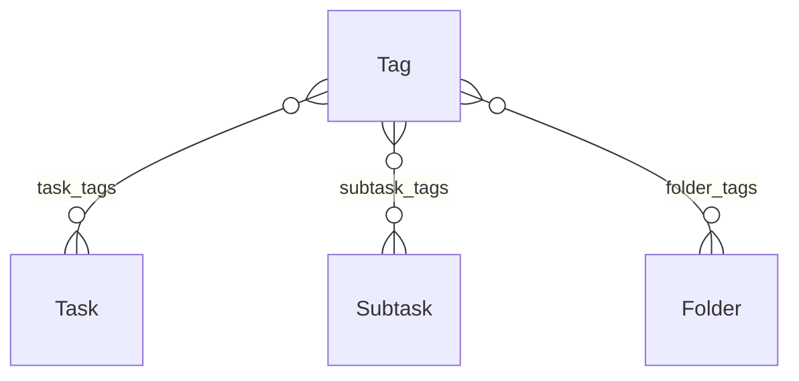

## Overview

Tags provide a flexible, multi-dimensional way to categorize your tasks, subtasks, and folders. Unlike folders which provide hierarchical structure, tags allow items to belong to multiple categories simultaneously.

## Tag Model

The Tag entity is defined in `/src/main/kotlin/com/expozcode/task_pro_api/model/Tag.kt`:

```kotlin
@Entity
@Table(name = "tags")
data class Tag(
    @Id
    @GeneratedValue(strategy = GenerationType.IDENTITY)
    val tagId: Long? = null,
    
    var userId: Long,
    var tagName: String,              // Required, max 100 chars
    var color: String? = null,        // Hex color, max 7 chars
    var createdAt: LocalDateTime? = null,
    var updatedAt: LocalDateTime? = null,
    var tasks: Set<Task> = emptySet(),
    var subtasks: Set<Subtask> = emptySet(),
    var folders: Set<Folder> = emptySet()
)
```

## Tag Properties

<AccordionGroup>
  <Accordion title="tagId (Long)">
    Auto-generated unique identifier. Read-only.
  </Accordion>
  
  <Accordion title="userId (Long)">
    The owner of this tag. Tags are isolated per user.
  </Accordion>
  
  <Accordion title="tagName (String)">
    **Required.** The tag's name (max 100 characters).
    
    ```json
    "tagName": "urgent"
    ```
    
    <Tip>
    Use lowercase, hyphenated names for consistency: `high-priority`, `client-work`, `bug-fix`.
    </Tip>
  </Accordion>
  
  <Accordion title="color (String)">
    **Optional.** Hex color code for visual identification (max 7 characters, including #).
    
    ```json
    "color": "#FF0000"
    ```
    
    Common color conventions:
    - Red (`#FF0000`) - Urgent, critical
    - Orange (`#FFA500`) - High priority
    - Yellow (`#FFFF00`) - Warning, attention needed
    - Green (`#00FF00`) - Success, completed
    - Blue (`#0000FF`) - Information, routine
    - Purple (`#800080`) - Planning, future
  </Accordion>
  
  <Accordion title="createdAt (LocalDateTime)">
    Automatically set when the tag is created. Read-only.
  </Accordion>
  
  <Accordion title="updatedAt (LocalDateTime)">
    Automatically updated when the tag is modified. Read-only.
  </Accordion>
</AccordionGroup>

## Tag Relationships

Tags have many-to-many relationships with:

- **Tasks** - A task can have multiple tags, and a tag can be applied to multiple tasks
- **Subtasks** - Subtasks can be tagged independently of their parent task
- **Folders** - Folders can be tagged to categorize entire project areas



## API Operations

### Create a Tag

**Endpoint:** `POST /api/tags`

**Request DTO:**

```kotlin
data class TagCreateDto(
    val tagName: String,
    val color: String? = null
)
```

**Example:**

```bash
curl -X POST http://localhost:8080/api/tags \
  -H "Authorization: Bearer YOUR_TOKEN" \
  -H "Content-Type: application/json" \
  -d '{
    "tagName": "urgent",
    "color": "#FF0000"
  }'
```

**Response (201 Created):**

```json
{
  "tagId": 1,
  "tagName": "urgent",
  "color": "#FF0000"
}
```

### List All Tags

**Endpoint:** `GET /api/tags`

**Example:**

```bash
curl -X GET http://localhost:8080/api/tags \
  -H "Authorization: Bearer YOUR_TOKEN"
```

**Response (200 OK):**

```json
[
  {
    "tagId": 1,
    "tagName": "urgent",
    "color": "#FF0000"
  },
  {
    "tagId": 2,
    "tagName": "backend",
    "color": "#3B82F6"
  },
  {
    "tagId": 3,
    "tagName": "frontend",
    "color": "#10B981"
  },
  {
    "tagId": 4,
    "tagName": "bug",
    "color": "#EF4444"
  }
]
```

### Get a Single Tag

**Endpoint:** `GET /api/tags/{tagId}`

**Example:**

```bash
curl -X GET http://localhost:8080/api/tags/1 \
  -H "Authorization: Bearer YOUR_TOKEN"
```

**Response (200 OK):**

```json
{
  "tagId": 1,
  "tagName": "urgent",
  "color": "#FF0000"
}
```

**Error Response (404 Not Found):**

```json
{
  "detail": "Tag not found"
}
```

### Update a Tag

**Endpoint:** `PUT /api/tags/{tagId}`

**Request DTO:**

```kotlin
data class TagUpdateDto(
    val tagName: String? = null,
    val color: String? = null
)
```

**Example:**

```bash
curl -X PUT http://localhost:8080/api/tags/1 \
  -H "Authorization: Bearer YOUR_TOKEN" \
  -H "Content-Type: application/json" \
  -d '{
    "tagName": "critical",
    "color": "#DC2626"
  }'
```

**Response (200 OK):**

```json
{
  "tagId": 1,
  "tagName": "critical",
  "color": "#DC2626"
}
```

<Note>
Updating a tag automatically updates all tasks, subtasks, and folders using that tag.
</Note>

### Delete a Tag

**Endpoint:** `DELETE /api/tags/{tagId}`

**Example:**

```bash
curl -X DELETE http://localhost:8080/api/tags/1 \
  -H "Authorization: Bearer YOUR_TOKEN"
```

**Response (204 No Content)**

<Warning>
Deleting a tag removes it from all associated tasks, subtasks, and folders. This operation cannot be undone.
</Warning>

## Using Tags with Tasks

### Add Tags When Creating a Task

```bash
curl -X POST http://localhost:8080/api/tasks \
  -H "Authorization: Bearer YOUR_TOKEN" \
  -H "Content-Type: application/json" \
  -d '{
    "title": "Fix login bug",
    "description": "Users cannot login with special characters in password",
    "priority": 8,
    "status": "pending",
    "tagIds": [1, 4]  # urgent + bug tags
  }'
```

**Response includes tags:**

```json
{
  "taskId": 42,
  "userId": 1,
  "folderId": null,
  "tags": [
    {"tagId": 1, "tagName": "urgent", "color": "#FF0000"},
    {"tagId": 4, "tagName": "bug", "color": "#EF4444"}
  ],
  "title": "Fix login bug",
  "description": "Users cannot login with special characters in password",
  "priority": 8,
  "status": "pending",
  "dueDate": null,
  "dueTime": null,
  "completedAt": null,
  "displayOrder": 0,
  "isArchived": false,
  "createdAt": "2026-03-13T10:00:00",
  "updatedAt": "2026-03-13T10:00:00"
}
```

### Update Task Tags

```bash
# Replace all tags on a task
curl -X PUT http://localhost:8080/api/tasks/42 \
  -H "Authorization: Bearer YOUR_TOKEN" \
  -H "Content-Type: application/json" \
  -d '{
    "tagIds": [2, 4]  # backend + bug tags
  }'

# Remove all tags from a task
curl -X PUT http://localhost:8080/api/tasks/42 \
  -H "Authorization: Bearer YOUR_TOKEN" \
  -H "Content-Type: application/json" \
  -d '{
    "tagIds": []
  }'
```

## Using Tags with Subtasks

### Add Tags When Creating a Subtask

```bash
curl -X POST http://localhost:8080/api/subtasks \
  -H "Authorization: Bearer YOUR_TOKEN" \
  -H "Content-Type: application/json" \
  -d '{
    "taskId": 42,
    "title": "Write unit tests",
    "description": "Add test coverage for password validation",
    "status": "pending",
    "tagIds": [2]  # backend tag
  }'
```

**Response:**

```json
{
  "subtaskId": 10,
  "taskId": 42,
  "tags": [
    {"tagId": 2, "tagName": "backend", "color": "#3B82F6"}
  ],
  "title": "Write unit tests",
  "description": "Add test coverage for password validation",
  "durationTagId": null,
  "status": "pending",
  "completedAt": null,
  "displayOrder": 0,
  "createdAt": "2026-03-13T10:15:00",
  "updatedAt": "2026-03-13T10:15:00"
}
```

### Update Subtask Tags

```bash
curl -X PUT http://localhost:8080/api/subtasks/10 \
  -H "Authorization: Bearer YOUR_TOKEN" \
  -H "Content-Type: application/json" \
  -d '{
    "tagIds": [2, 5]  # backend + testing tags
  }'
```

## Using Tags with Folders

### Add Tags When Creating a Folder

```bash
curl -X POST http://localhost:8080/api/folders \
  -H "Authorization: Bearer YOUR_TOKEN" \
  -H "Content-Type: application/json" \
  -d '{
    "name": "Client Projects",
    "description": "All external client work",
    "color": "#3B82F6",
    "icon": "briefcase",
    "tagIds": [6, 7]  # client + billable tags
  }'
```

**Response:**

```json
{
  "folderId": 5,
  "userId": 1,
  "tags": [
    {"tagId": 6, "tagName": "client", "color": "#F59E0B"},
    {"tagId": 7, "tagName": "billable", "color": "#10B981"}
  ],
  "name": "Client Projects",
  "description": "All external client work",
  "color": "#3B82F6",
  "icon": "briefcase",
  "parentFolderId": null,
  "displayOrder": 0,
  "isArchived": false,
  "createdAt": "2026-03-13T10:30:00",
  "updatedAt": "2026-03-13T10:30:00"
}
```

## Tag Usage Patterns

### Priority Tags

Use tags to indicate priority levels:

```json
[
  {"tagName": "critical", "color": "#DC2626"},
  {"tagName": "high-priority", "color": "#F59E0B"},
  {"tagName": "normal", "color": "#3B82F6"},
  {"tagName": "low-priority", "color": "#6B7280"}
]
```

### Category Tags

Organize by work type:

```json
[
  {"tagName": "frontend", "color": "#10B981"},
  {"tagName": "backend", "color": "#3B82F6"},
  {"tagName": "design", "color": "#8B5CF6"},
  {"tagName": "documentation", "color": "#6B7280"},
  {"tagName": "testing", "color": "#F59E0B"}
]
```

### Status Tags

Additional status indicators beyond the built-in status field:

```json
[
  {"tagName": "blocked", "color": "#EF4444"},
  {"tagName": "waiting-review", "color": "#F59E0B"},
  {"tagName": "needs-feedback", "color": "#FBBF24"},
  {"tagName": "approved", "color": "#10B981"}
]
```

### Context Tags (GTD Style)

```json
[
  {"tagName": "@home", "color": "#8B5CF6"},
  {"tagName": "@work", "color": "#3B82F6"},
  {"tagName": "@computer", "color": "#6B7280"},
  {"tagName": "@phone", "color": "#10B981"},
  {"tagName": "@errands", "color": "#F59E0B"}
]
```

### Time/Energy Tags

```json
[
  {"tagName": "quick-win", "color": "#10B981"},
  {"tagName": "deep-work", "color": "#8B5CF6"},
  {"tagName": "5-minutes", "color": "#FBBF24"},
  {"tagName": "1-hour", "color": "#3B82F6"},
  {"tagName": "full-day", "color": "#EF4444"}
]
```

## Tag Filtering Strategies

### Client-Side Filtering by Tag

```javascript
// Fetch all tasks
const response = await fetch('http://localhost:8080/api/tasks', {
  headers: { 'Authorization': `Bearer ${token}` }
});
const tasks = await response.json();

// Filter tasks by tag name
function filterByTag(tasks, tagName) {
  return tasks.filter(task => 
    task.tags.some(tag => tag.tagName === tagName)
  );
}

const urgentTasks = filterByTag(tasks, 'urgent');
const backendTasks = filterByTag(tasks, 'backend');

// Filter by multiple tags (AND logic)
function filterByAllTags(tasks, tagNames) {
  return tasks.filter(task => 
    tagNames.every(name => 
      task.tags.some(tag => tag.tagName === name)
    )
  );
}

const urgentBackendTasks = filterByAllTags(tasks, ['urgent', 'backend']);

// Filter by multiple tags (OR logic)
function filterByAnyTag(tasks, tagNames) {
  return tasks.filter(task => 
    tagNames.some(name => 
      task.tags.some(tag => tag.tagName === name)
    )
  );
}

const importantTasks = filterByAnyTag(tasks, ['urgent', 'high-priority']);
```

### Building a Tag Cloud

```javascript
// Count tag usage across all tasks
function buildTagCloud(tasks) {
  const tagCounts = {};
  
  tasks.forEach(task => {
    task.tags.forEach(tag => {
      if (!tagCounts[tag.tagName]) {
        tagCounts[tag.tagName] = {
          tagId: tag.tagId,
          tagName: tag.tagName,
          color: tag.color,
          count: 0
        };
      }
      tagCounts[tag.tagName].count++;
    });
  });
  
  return Object.values(tagCounts).sort((a, b) => b.count - a.count);
}

const tagCloud = buildTagCloud(tasks);
console.log(tagCloud);
// [
//   {tagId: 1, tagName: "urgent", color: "#FF0000", count: 12},
//   {tagId: 2, tagName: "backend", color: "#3B82F6", count: 8},
//   ...
// ]
```

## Tag Management Workflow

<Steps>
  <Step title="Create your tag system">
    Start with 5-10 core tags that represent your main categories:
    
    ```bash
    # Priority tags
    POST /api/tags {"tagName": "urgent", "color": "#FF0000"}
    POST /api/tags {"tagName": "important", "color": "#FFA500"}
    
    # Category tags
    POST /api/tags {"tagName": "frontend", "color": "#10B981"}
    POST /api/tags {"tagName": "backend", "color": "#3B82F6"}
    POST /api/tags {"tagName": "bug", "color": "#EF4444"}
    ```
  </Step>
  
  <Step title="Apply tags consistently">
    Tag items as you create them:
    
    ```bash
    POST /api/tasks {
      "title": "Fix authentication bug",
      "tagIds": [1, 4, 5]  # urgent + backend + bug
    }
    ```
  </Step>
  
  <Step title="Review and refine">
    Periodically review your tags:
    - Merge duplicate or similar tags
    - Delete unused tags
    - Rename tags for clarity
    - Adjust colors for better visual distinction
  </Step>
  
  <Step title="Create views">
    Use tags to create different views in your application:
    - "Urgent items" view (filter by urgent tag)
    - "Backend work" view (filter by backend tag)
    - "This week" view (combine due date + priority tags)
  </Step>
</Steps>

## Best Practices

<CardGroup cols={2}>
  <Card title="Keep Tag Names Short" icon="text-width">
    Use 1-2 words maximum. "urgent" instead of "urgent-and-important-tasks".
  </Card>
  
  <Card title="Use Consistent Colors" icon="palette">
    Stick to a color scheme. Red for urgent, blue for info, green for success, etc.
  </Card>
  
  <Card title="Limit Tag Count" icon="hashtag">
    10-20 tags is ideal. Too many tags become overwhelming and unused.
  </Card>
  
  <Card title="Avoid Redundant Tags" icon="clone">
    Don't create tags that duplicate existing fields (e.g., "completed" when status exists).
  </Card>
  
  <Card title="Tag Subtasks Independently" icon="list">
    Subtasks can have different tags than their parent task for granular filtering.
  </Card>
  
  <Card title="Use Tags for Cross-Cutting Concerns" icon="scissors">
    Use tags for categories that span multiple folders (e.g., "client", "urgent", "blocked").
  </Card>
</CardGroup>

## Tag vs. Folder Decision Guide

<Tabs>
  <Tab title="Use Folders When...">
    - Items belong to **one** category
    - You need **hierarchical structure**
    - Category is **permanent** (e.g., project ownership)
    - You want to **move items** between categories
    - Structure is **predictable** and **stable**
    
    **Example:** Work Projects > Client A > Phase 1
  </Tab>
  
  <Tab title="Use Tags When...">
    - Items can belong to **multiple** categories
    - Categories are **temporary** or **contextual**
    - You need **flexible filtering**
    - Categories **change frequently**
    - You want **visual color coding**
    
    **Example:** urgent + backend + bug + blocked
  </Tab>
</Tabs>

<Tip>
Best practice: Use folders for "what project is this?" and tags for "what type of work is this?" and "what's the status?"
</Tip>

## Next Steps

<CardGroup cols={2}>
  <Card title="Tasks" icon="list-check" href="/concepts/tasks">
    Learn how to apply tags to tasks
  </Card>
  <Card title="Subtasks" icon="list" href="/concepts/subtasks">
    Use tags on subtasks for detailed categorization
  </Card>
  <Card title="Folders" icon="folder" href="/concepts/folders">
    Combine folders and tags for powerful organization
  </Card>
</CardGroup>
