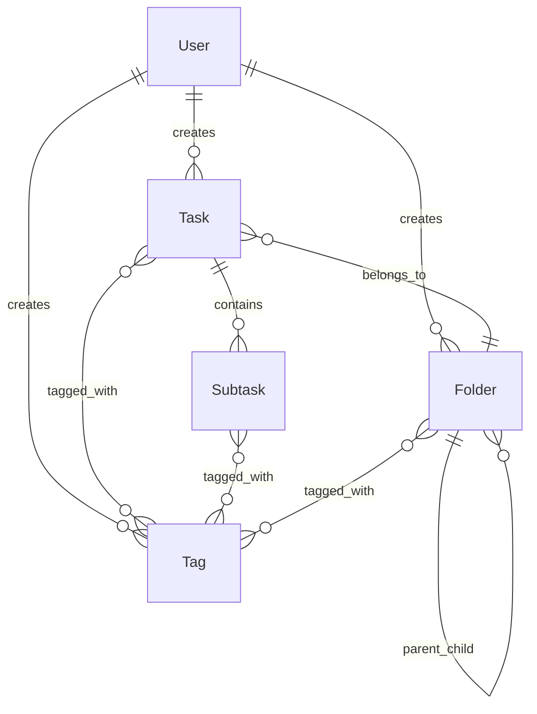

## What is Task Pro API?

Task Pro API is a modern, production-ready REST API built with Spring Boot and Kotlin that provides comprehensive task management capabilities. It enables developers to build powerful productivity applications with features like hierarchical folder organization, flexible tagging systems, and subtask management.

## Core Features

<CardGroup cols={2}>
  <Card title="Task Management" icon="list-check">
    Create, update, and organize tasks with priorities, due dates, statuses, and custom descriptions
  </Card>
  <Card title="Folder Hierarchy" icon="folder-tree">
    Organize tasks in nested folders with custom colors, icons, and descriptions
  </Card>
  <Card title="Tagging System" icon="tags">
    Apply color-coded tags to tasks, subtasks, and folders for flexible categorization
  </Card>
  <Card title="Subtask Tracking" icon="list">
    Break down complex tasks into subtasks with automatic progress calculation
  </Card>
  <Card title="JWT Authentication" icon="shield-check">
    Secure user authentication with JWT tokens using industry-standard practices
  </Card>
  <Card title="Archive & Filter" icon="filter">
    Archive completed items and filter by status, folder, or custom criteria
  </Card>
</CardGroup>

## Architecture Overview

### Technology Stack

Task Pro API is built with modern technologies:

- **Framework**: Spring Boot 4.0.3
- **Language**: Kotlin 2.2.21 with JDK 17
- **Database**: PostgreSQL with JPA/Hibernate
- **Authentication**: JWT with Auth0 java-jwt library
- **Migrations**: Flyway for database versioning
- **Build Tool**: Gradle with Kotlin DSL

### Database Schema

The API uses a relational database design with the following core entities:



### API Design Principles

<Note>
The Task Pro API follows RESTful conventions with consistent response formats, proper HTTP status codes, and resource-based URL structures.
</Note>

**Key Design Patterns:**

- **Resource-based URLs**: `/api/tasks`, `/api/folders`, `/api/tags`
- **HTTP Methods**: GET (read), POST (create), PUT (update), DELETE (delete)
- **Status Codes**: 200 (success), 201 (created), 401 (unauthorized), 404 (not found)
- **Authentication**: Bearer token in Authorization header
- **Data Transfer Objects (DTOs)**: Separate request/response models for clean API contracts

## Data Models

### Task Statuses

Tasks and subtasks can have the following statuses:

- `pending` - Not yet started
- `in_progress` - Currently being worked on
- `completed` - Finished successfully
- `cancelled` - Abandoned or no longer needed

### Priority Levels

Tasks support integer-based priorities (default: 0). Higher numbers indicate higher priority.

### Timestamps

All entities automatically track:
- `created_at` - When the resource was created
- `updated_at` - When the resource was last modified
- `completed_at` - When a task/subtask was marked complete

## API Endpoints Overview

### Authentication
- `POST /api/auth/register` - Create new user account
- `POST /api/auth/login` - Authenticate and receive JWT token
- `GET /api/auth/me` - Get current user profile

### Tasks
- `POST /api/tasks` - Create a new task
- `GET /api/tasks` - List tasks (with filters)
- `GET /api/tasks/{taskId}` - Get task details
- `PUT /api/tasks/{taskId}` - Update a task
- `DELETE /api/tasks/{taskId}` - Delete a task

### Folders
- `POST /api/folders` - Create a folder
- `GET /api/folders` - List folders
- `GET /api/folders/{folderId}` - Get folder details
- `PUT /api/folders/{folderId}` - Update a folder
- `DELETE /api/folders/{folderId}` - Delete a folder

### Tags
- `POST /api/tags` - Create a tag
- `GET /api/tags` - List all tags
- `GET /api/tags/{tagId}` - Get tag details
- `PUT /api/tags/{tagId}` - Update a tag
- `DELETE /api/tags/{tagId}` - Delete a tag

### Subtasks
- `POST /api/subtasks` - Create a subtask
- `GET /api/tasks/{taskId}/subtasks` - List subtasks for a task
- `PUT /api/subtasks/{subtaskId}` - Update a subtask
- `DELETE /api/subtasks/{subtaskId}` - Delete a subtask

## Health Check

The API includes Spring Boot Actuator for monitoring:

```bash
GET http://localhost:8080/actuator/health
```

## Next Steps

<CardGroup cols={2}>
  <Card title="Quick Start" icon="rocket" href="/quickstart">
    Get started with your first API call in minutes
  </Card>
  <Card title="Authentication" icon="key" href="/authentication">
    Learn how to authenticate and secure your requests
  </Card>
  <Card title="Task Concepts" icon="book" href="/concepts/tasks">
    Understand task models, statuses, and priorities
  </Card>
  <Card title="Deployment" icon="server" href="/deployment/docker">
    Deploy Task Pro API to production
  </Card>
</CardGroup>
